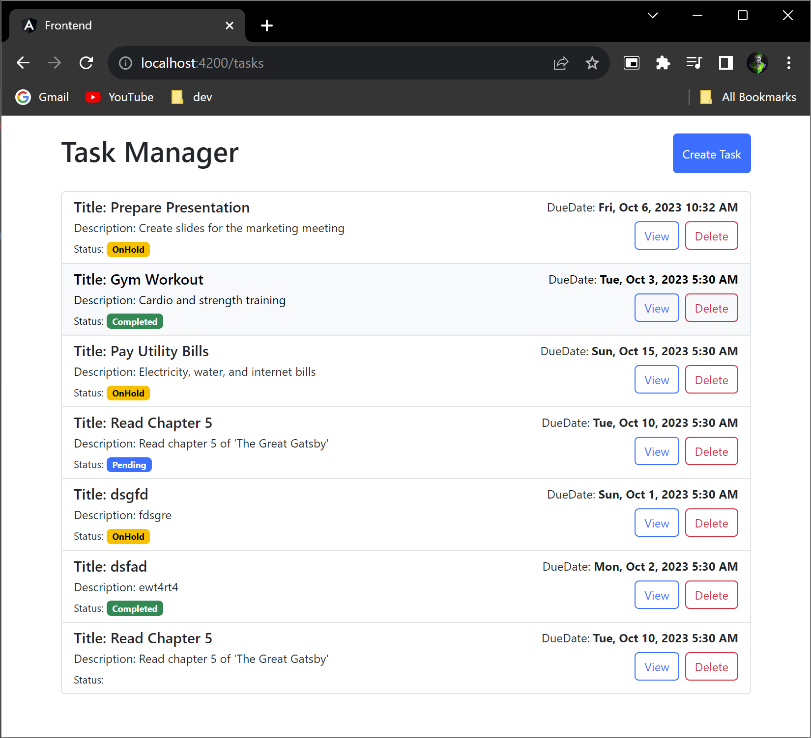
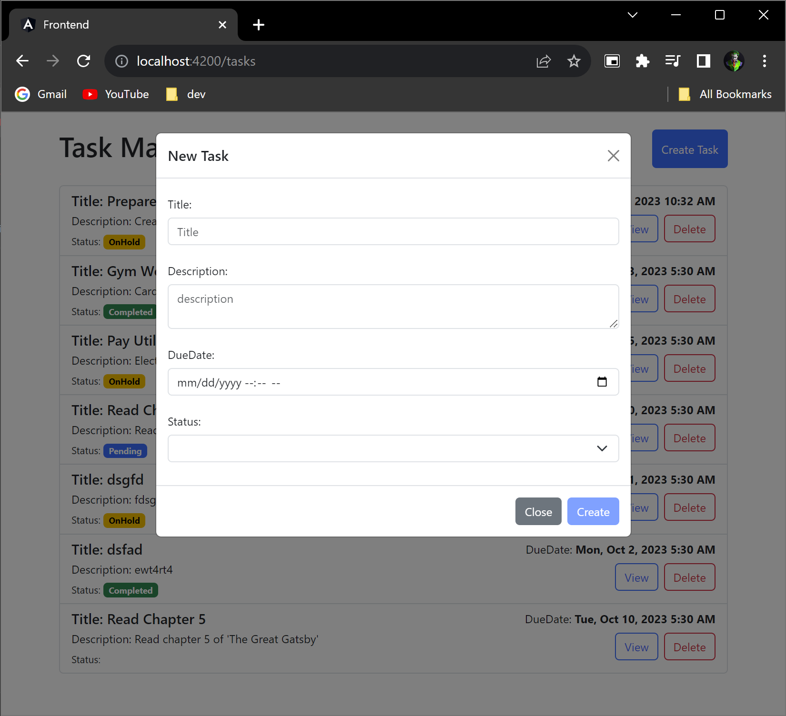
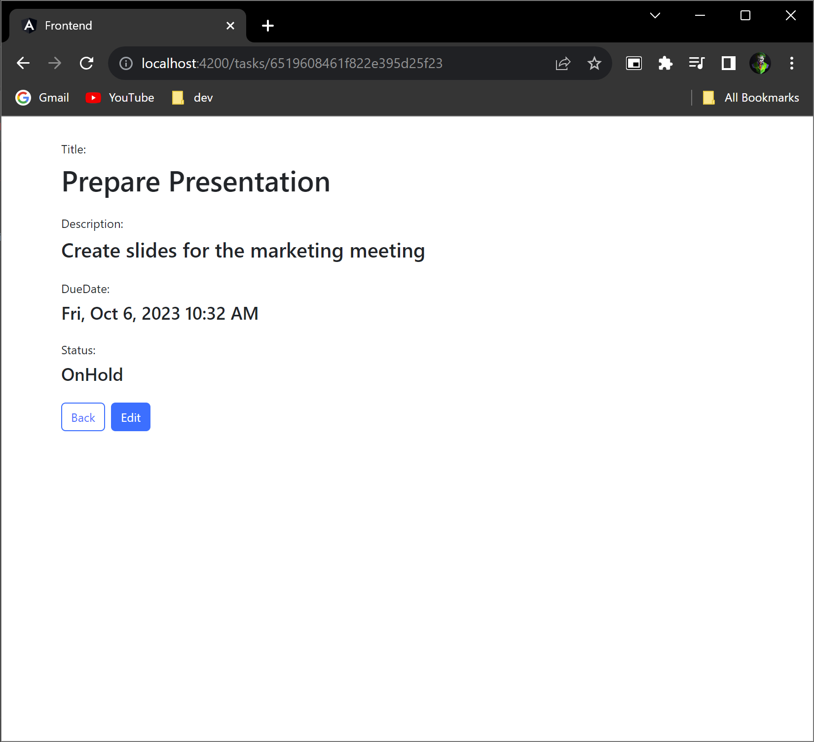
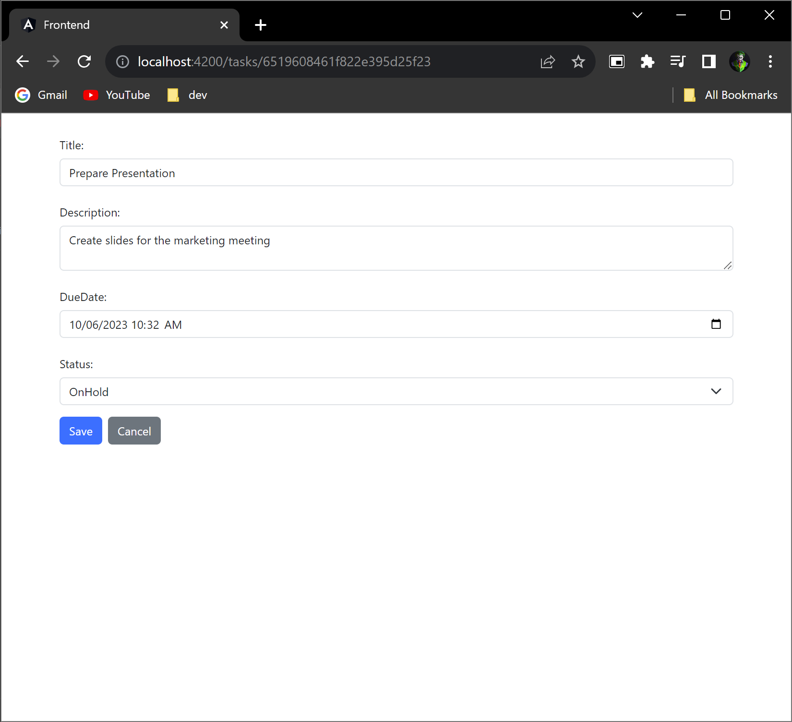

# TASK MANAGER - Frontend

This project was generated with [Angular CLI](https://github.com/angular/angular-cli) version 16.2.4.

## Development server

Run `ng serve` for a dev server. Navigate to `http://localhost:4200/`. The application will automatically reload if you change any of the source files.

## Code scaffolding

Run `ng generate component component-name` to generate a new component. You can also use `ng generate directive|pipe|service|class|guard|interface|enum|module`.

## Build

Run `ng build` to build the project. The build artifacts will be stored in the `dist/` directory.

## Further help

To get more help on the Angular CLI use `ng help` or go check out the [Angular CLI Overview and Command Reference](https://angular.io/cli) page.

# Project UI

### Home Page

- List Available tasks. user can view details of the task, delete the task.
  

### Create Task Page

- To create new task in the task manager.
  

### View Task Page

- View task details. user can edit task in new route(page).
  

### Edit Task Page

- User can edit the current task and save.
  
